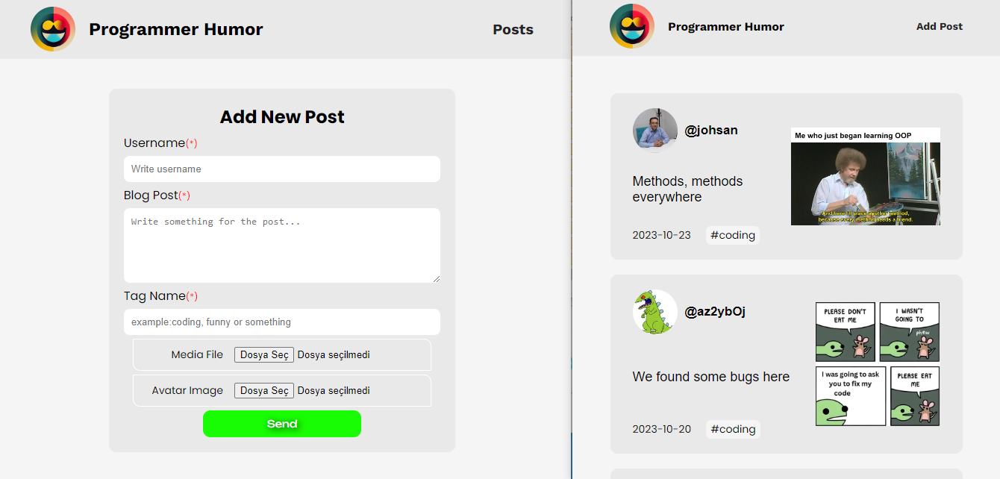

# Programmer Humor

# MVC Project

## MVC ( Model View Controller)

- Model, MVC’de projenin iş mantığının (business logic) oluşturulduğu bölümdür. İş mantığıyla beraber doğrulama (validation) ve veri erişim (data access) işlemleri de bu bölümde gerçekleştirilmektedir.
- View, MVC’de projenin arayüzlerinin oluşturulduğu bölümdür. Bu bölümde projenin kullanıcılara sunulacak olan HTML dosyaları yer almaktadır.
- Controller, MVC’de projenin iç süreçlerini kontrol eden bölümdür. Bu bölümde View ile Model arasındaki bağlantı kurulur. Kullanıcılardan gelen istekler (request) Controller’larda değerlendirilir, isteğin detayına göre hangi işlemlerin yapılacağı ve kullanıcıya hangi View’ın döneceği (response) belirtilir.

# Kütüphaneler

- axios
- react-router-dom
- json-server
- sass

- API: https://programmer-humor.p.rapidapi.com/api/reddit',

## Preview

# MVC_Project-Programmer_Humor
